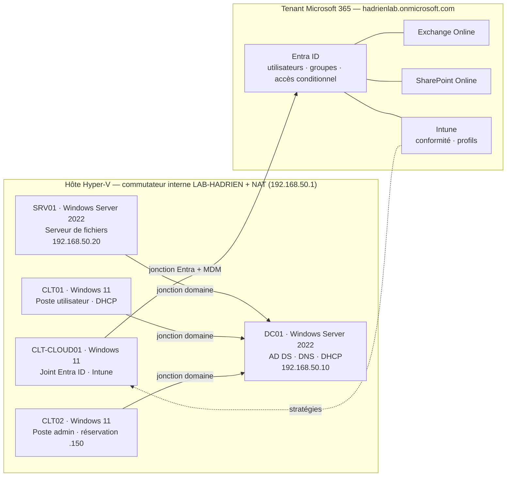

# Homelab Active Directory & modern workplace

**Windows Server · Active Directory · Microsoft 365 · Intune**, entièrement scripté en PowerShell.

Ce dépôt reconstruit de bout en bout un petit système d'information d'entreprise. La partie locale repose sur un contrôleur de domaine (DNS, DHCP), des unités d'organisation, des groupes, trois machines jointes, des GPO de sécurité et des scripts d'administration. La partie cloud comprend un tenant Microsoft 365 (Entra ID, Exchange Online, SharePoint Online, MFA par accès conditionnel) et un poste Windows inscrit dans Intune.

Chaque étape est un script **idempotent** : on peut le relancer sans casser l'existant. Chaque script accepte `-WhatIf` et lit une **configuration unique** (`config/lab.psd1`). Des scripts d'export produisent des **rapports HTML de preuve** de l'état réel du lab.

---

## Cahier des charges → réalisation

| Exigence | Réalisation | Script(s) | Doc |
|---|---|---|---|
| Contrôleur de domaine | Forêt `corp.hadrien.lab`, niveau 2016, DC01 en IP fixe | `ad/01`, `ad/02` | [02](docs/02-controleur-domaine.md) |
| DNS | Zone AD intégrée, zone inverse, redirecteurs, nettoyage, contrôle des SRV | `ad/03` | [02](docs/02-controleur-domaine.md) |
| DHCP | Autorisé dans AD, étendue, exclusions, réservation, options 003/006/015, DNS dynamique | `ad/04` | [02](docs/02-controleur-domaine.md) |
| OU | Arborescence sous une OU racine protégée, redirection `redircmp`/`redirusr` | `ad/05` | [03](docs/03-annuaire.md) |
| Groupes | Modèle AGDLP (GG-* rôles → DL-* ressources) | `ad/05`, `ad/06` | [03](docs/03-annuaire.md) |
| Trois machines jointes | SRV01 (serveur de fichiers), CLT01, CLT02, chacune dans son OU | `ad/07`, `ad/09` | [04](docs/04-machines-membres.md) |
| GPO de sécurité | 5 GPO : baseline, durcissement postes, LAPS, verrouillage, lecteurs | `ad/08`, `ad/11` | [05](docs/05-gpo-securite.md) |
| Scripts PowerShell d'administration | Module `LabAdmin` (arrivée, départ, réinitialisation, audit) + rapport HTML | `modules/LabAdmin`, `ad/10` | [06](docs/06-administration-powershell.md) |
| Tenant Microsoft 365 / Entra ID | Utilisateurs, licences par groupe, groupes dynamiques, groupes M365 | `m365/21` | [07](docs/07-microsoft-365.md) |
| Exchange | Boîtes partagées, liste dynamique, SMTP AUTH/POP/IMAP coupés, audit | `m365/22` | [07](docs/07-microsoft-365.md) |
| SharePoint | Intranet de communication, sites d'équipe, partage externe maîtrisé | `m365/23` | [07](docs/07-microsoft-365.md) |
| MFA | Accès conditionnel (MFA, blocage de l'authentification héritée) + compte break-glass | `m365/24` | [07](docs/07-microsoft-365.md) |
| Enrôlement Intune | Inscription automatique, conformité, profils, poste CLT-CLOUD01 vérifié | `m365/25`, `m365/26` | [08](docs/08-intune.md) |

---

## Architecture



Le détail (plan d'adressage, arborescence, matrice des GPO) se trouve dans [docs/01-architecture.md](docs/01-architecture.md).

---

## Démarrage rapide

```powershell
# 0. Sur l'hôte Hyper-V : réseau + 5 VM (Gen2, Secure Boot, vTPM)
.\scripts\host\00-New-HyperVLab.ps1

# 1. Sur DC01 (après installation de Windows Server)
.\scripts\ad\01-Prepare-DC.ps1          # nom, IP fixe, DNS — redémarre
.\scripts\ad\02-Install-ADDS.ps1        # forêt — redémarre
.\scripts\ad\03-Configure-DNS.ps1
.\scripts\ad\04-Configure-DHCP.ps1
.\scripts\ad\05-Create-OUStructure.ps1
.\scripts\ad\06-Import-Users.ps1

# 2. Sur SRV01, CLT01, CLT02
.\scripts\ad\07-Join-Domain.ps1 -ComputerName CLT01

# 3. Sur DC01 puis SRV01
.\scripts\ad\08-Configure-SecurityGPOs.ps1
.\scripts\ad\09-Configure-FileServer.ps1   # sur SRV01

# 4. Depuis le poste d'administration (CLT02)
.\scripts\m365\20-Install-M365Modules.ps1
.\scripts\m365\21-Provision-EntraIdentities.ps1
.\scripts\m365\22-Configure-Exchange.ps1
powershell.exe -File .\scripts\m365\23-Configure-SharePoint.ps1 -OwnerUpn admin@<tenant>.onmicrosoft.com
.\scripts\m365\24-Configure-MFA-ConditionalAccess.ps1   # puis -Enforce après vérification
.\scripts\m365\25-Configure-Intune.ps1

# 5. Sur CLT-CLOUD01 après la jonction Entra ID
.\scripts\m365\26-Test-IntuneEnrollment.ps1

# 6. Preuves
.\scripts\ad\10-Export-ADReport.ps1
.\scripts\ad\11-Test-MemberHardening.ps1     # sur chaque machine jointe
.\scripts\m365\27-Export-M365Report.ps1 -IncludeExchange
```

Avant tout, adapte `config/lab.psd1` : nom du tenant, chemins des ISO, carte réseau. Le guide complet commence par [docs/00-prerequis.md](docs/00-prerequis.md).

---

## Arborescence

```
├── config/lab.psd1              Configuration unique (réseau, OU, groupes, GPO, M365, Intune, VM)
├── data/                        users.csv (12 comptes fictifs), admins.csv (comptes adm-*)
├── modules/
│   ├── LabCommon/               Configuration, journalisation, nommage, mots de passe, rapports HTML
│   ├── LabGpo/                  GptTmpl.inf, Drives.xml, versionnage des GPO
│   ├── LabAdmin/                Administration courante et audit de l'annuaire
│   └── LabM365/                 Accès Microsoft Graph (pagination, recherche, erreurs)
├── scripts/
│   ├── host/                    00 — Hyper-V : réseau NAT et VM
│   ├── ad/                      01 → 11 — Active Directory
│   └── m365/                    20 → 27 — Microsoft 365 et Intune
├── tests/                       Pester : modules, cohérence de la configuration, qualité des scripts
├── docs/                        Guide pas à pas, choix techniques, captures
└── .github/workflows/ci.yml     PSScriptAnalyzer + Pester à chaque push
```

---

## Choix techniques notables

- **Sécurité de l'annuaire pensée par un profil offensif.** Chaque GPO de durcissement est reliée, dans la [doc 05](docs/05-gpo-securite.md), à l'attaque qu'elle neutralise : empoisonnement LLMNR, relais NTLM, vol d'identifiants WDigest, réutilisation du mot de passe administrateur local, création de comptes machine. Le module `LabAdmin` détecte les comptes Kerberoastables et AS-REP roastables.
- **Moindre privilège.** Les comptes `adm-*` sont séparés des comptes de bureautique. La jonction au domaine est déléguée à `GG-Admins-Postes` plutôt que confiée aux admins du domaine, `ms-DS-MachineAccountQuota` est fixé à 0, une FGPP plus stricte s'applique aux comptes à privilèges et les admins du domaine sont placés dans Protected Users.
- **Aucun secret dans Git.** Les mots de passe sont générés aléatoirement à l'exécution (`RandomNumberGenerator`) et écrits dans `output/secrets/`, dossier exclu par `.gitignore`.
- **Indépendant de la langue de Windows.** Les groupes intégrés (Admins du domaine, Administrateurs, Utilisateurs authentifiés) sont résolus par SID : les scripts tournent sur un Windows français comme anglais.
- **Accès conditionnel sans risque de verrouillage.** Le compte break-glass est créé avant toute stratégie et exclu de chacune. Les stratégies naissent en mode « rapport uniquement » et ne passent en mode « activé » qu'avec `-Enforce`.
- **Graph sans SDK lourd.** Seul `Microsoft.Graph.Authentication` est requis. Chaque appel `Invoke-MgGraphRequest` correspond à un point de terminaison REST documenté.

---

## Captures d'écran

Les captures attendues (nom de fichier, écran à montrer, script qui produit l'état) sont listées dans [docs/screenshots/README.md](docs/screenshots/README.md). Les rapports HTML générés par les scripts `10`, `11` et `27` complètent ces captures avec des preuves textuelles horodatées.

---

## Inspirations

Ce dépôt a été conçu à partir des approches de plusieurs labs open source. Aucun code ni aucune image n'en a été repris :

- [Ofendor/Service-Desk-Support-Lab](https://github.com/Ofendor/Service-Desk-Support-Lab) : scripts numérotés par étape, GPO de mots de passe et de lecteurs mappés
- [j5s/adlab](https://github.com/j5s/adlab) : déploiement AD sans interaction en PowerShell
- [mbusbee505/Intune-Lab](https://github.com/mbusbee505/Intune-Lab) : déroulé tenant → groupes → licences → enrôlement
- [JC-Logic/ConditionalAccessBaseline](https://github.com/JC-Logic/ConditionalAccessBaseline) : nommage des stratégies d'accès conditionnel
- [cmcabrera-tech](https://github.com/cmcabrera-tech) et [Pontipek](https://github.com/Pontipek) : séparation AD on-prem / Entra-Intune en portfolio

## Licence

[MIT](LICENSE). Environnement de laboratoire : ne pas appliquer tel quel en production sans revue.
