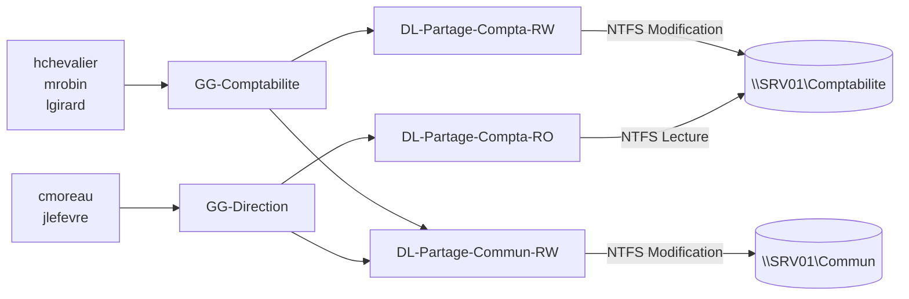

# 01 — Architecture

## Machines

| Nom | Système | Rôle | Adressage | Appartenance |
|---|---|---|---|---|
| DC01 | Windows Server 2022 | AD DS, DNS, DHCP, GPMC | 192.168.50.10 (fixe) | Contrôleur de `corp.hadrien.lab` |
| SRV01 | Windows Server 2022 | Serveur de fichiers (disque D:) | 192.168.50.20 (fixe) | Membre, OU `Ordinateurs/Serveurs` |
| CLT01 | Windows 11 | Poste utilisateur | DHCP | Membre, OU `Ordinateurs/Postes` |
| CLT02 | Windows 11 | Poste d'administration, outils M365 | DHCP, réservation .150 | Membre, OU `Ordinateurs/Postes` |
| CLT-CLOUD01 | Windows 11 | Poste moderne géré par Intune | DHCP | Joint à Entra ID, hors domaine AD |

## Plan d'adressage — 192.168.50.0/24

| Plage | Usage |
|---|---|
| .1 | Passerelle (hôte Hyper-V, NAT) |
| .10 – .19 | Contrôleurs de domaine |
| .20 – .49 | Serveurs à IP fixe |
| .100 – .109 | Exclus de l'étendue (équipements à venir) |
| .110 – .200 | Baux DHCP des postes |
| .150 | Réservation CLT02 (MAC fixée par le script Hyper-V) |

Options DHCP : 003 routeur `192.168.50.1`, 006 DNS `192.168.50.10`, 015 suffixe `corp.hadrien.lab`. Le serveur DHCP enregistre lui-même les clients dans le DNS (mises à jour sécurisées uniquement).

## Arborescence Active Directory

```
corp.hadrien.lab
├── Domain Controllers                 ← Default Domain Controllers Policy
└── HADRIEN-LAB                        (OU racine, protégée)
    ├── Utilisateurs                   ← GPO-USR-Verrouillage-Ecran, GPO-USR-Lecteurs-Reseau
    │   ├── Direction
    │   ├── IT
    │   ├── Comptabilite
    │   └── Commercial
    ├── Ordinateurs                    ← GPO-SEC-Ordinateurs-Baseline, GPO-SEC-LAPS
    │   ├── Postes                     ← GPO-SEC-Postes-Durcissement   (cible de redircmp)
    │   └── Serveurs
    ├── Groupes
    │   ├── Securite                   GG-* : un groupe global par rôle métier
    │   └── Ressources                 DL-* : un groupe domaine local par droit sur une ressource
    ├── Comptes-Admin                  adm-* : comptes d'administration nominatifs
    ├── Comptes-Service
    └── Desactives                     comptes des collaborateurs partis
```

Les utilisateurs et ordinateurs sont séparés dans deux branches. Les GPO utilisateur se lient sur `Utilisateurs` et les GPO ordinateur sur `Ordinateurs`, sans recourir au *loopback* ni au filtrage de sécurité.

## Modèle de groupes AGDLP

> **A**ccounts → **G**lobal groups → **D**omain **L**ocal groups → **P**ermissions



Les ACL ne contiennent que des groupes `DL-*` : on ne touche jamais aux droits NTFS. Donner l'accès à quelqu'un revient à l'ajouter à son groupe métier. Un test Pester vérifie qu'aucun groupe global n'est imbriqué dans un autre groupe global.

## Matrice des GPO

| GPO | Liée à | Configuration | Contenu principal |
|---|---|---|---|
| GPO-SEC-Ordinateurs-Baseline | Ordinateurs | Ordinateur | NTLMv2 seul, signature SMB, SMBv1/WDigest coupés, LSA protégée, audit, journalisation PowerShell, pare-feu, bannière |
| GPO-SEC-Postes-Durcissement | Ordinateurs/Postes | Ordinateur | LLMNR off, autorun off, USB bloqué, Defender PUA, `GG-Admins-Postes` admin local |
| GPO-SEC-LAPS | Ordinateurs | Ordinateur | Windows LAPS : 16 caractères, rotation 30 j, chiffré dans AD |
| GPO-USR-Verrouillage-Ecran | Utilisateurs | Utilisateur | Écran de veille sécurisé après 10 min |
| GPO-USR-Lecteurs-Reseau | Utilisateurs | Utilisateur | P: Commun (tous), K: Comptabilité (GG-Comptabilite, GG-Direction) |
| *Default Domain Policy* | Domaine | Ordinateur | Mots de passe 12 car., historique 24, verrouillage 5 essais / 15 min |
| *PSO-Comptes-Admin* (FGPP) | GG-Admins-Postes, Admins du domaine | — | 16 caractères, 90 jours, verrouillage 3 essais / 30 min |

## Microsoft 365

| Objet | Type | Rôle |
|---|---|---|
| 9 utilisateurs (colonne `M365=true`) | Cloud only | UPN `<identifiant>@<tenant>`, même identifiant que dans AD |
| SG-M365-Licences | Sécurité, attribué | Porte la licence E5 / Business Premium (licence par groupe) |
| SG-Dyn-IT, SG-Dyn-Comptabilite | Sécurité, dynamique | `user.department -eq "..."` |
| SG-Dyn-Postes-Windows | Sécurité, dynamique (appareils) | Cible des stratégies Intune |
| Equipe-IT, Equipe-Comptabilite | Microsoft 365 | Boîte de groupe + site d'équipe SharePoint |
| support@, factures@ | Boîtes partagées | Accès complet et « Envoyer en tant que » pour le service |
| tous@ | Liste de diffusion dynamique | Toutes les boîtes utilisateurs |
| bg-admin | Compte d'urgence | Administrateur général, exclu de l'accès conditionnel |
| CA001 / CA002 / CA003 | Accès conditionnel | MFA, blocage de l'authentification héritée, MFA à l'inscription d'appareil |

L'annuaire AD et le tenant ne sont **pas synchronisés** : le cahier des charges les traite séparément. La synchronisation hybride (Entra Cloud Sync) est décrite dans [09-evolutions.md](09-evolutions.md).
